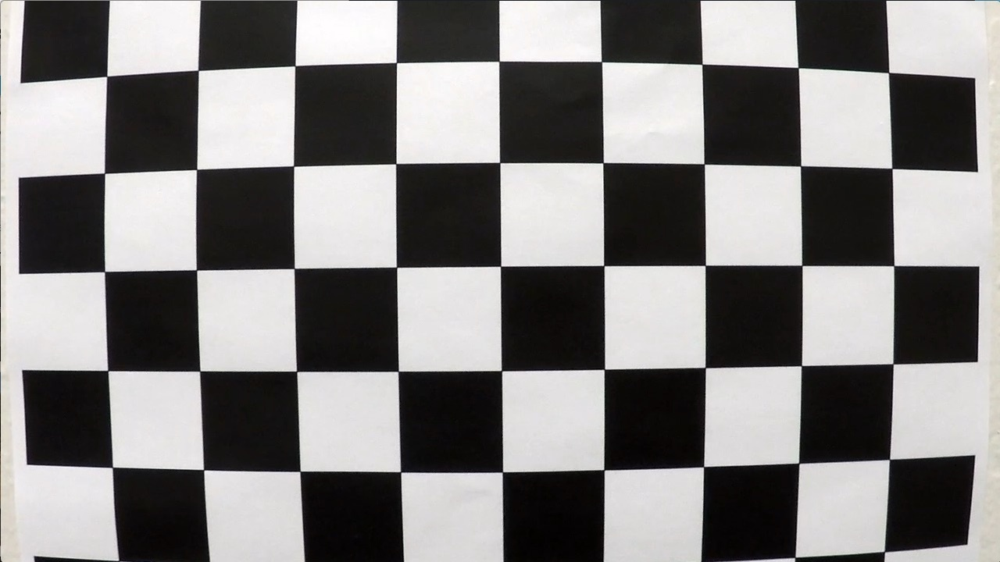
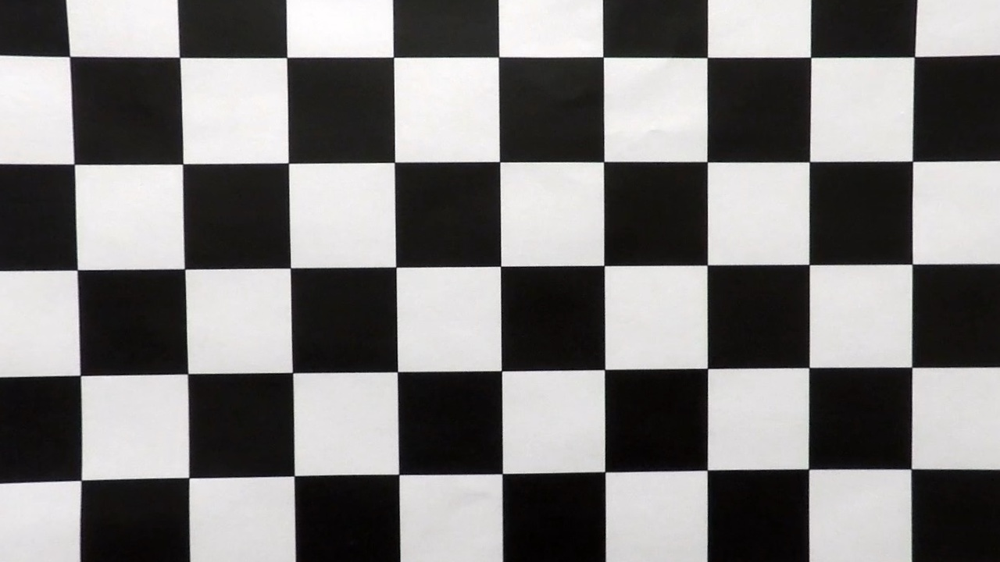
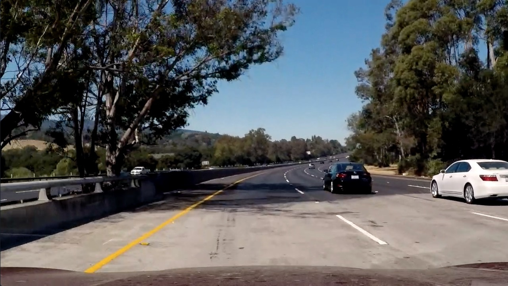
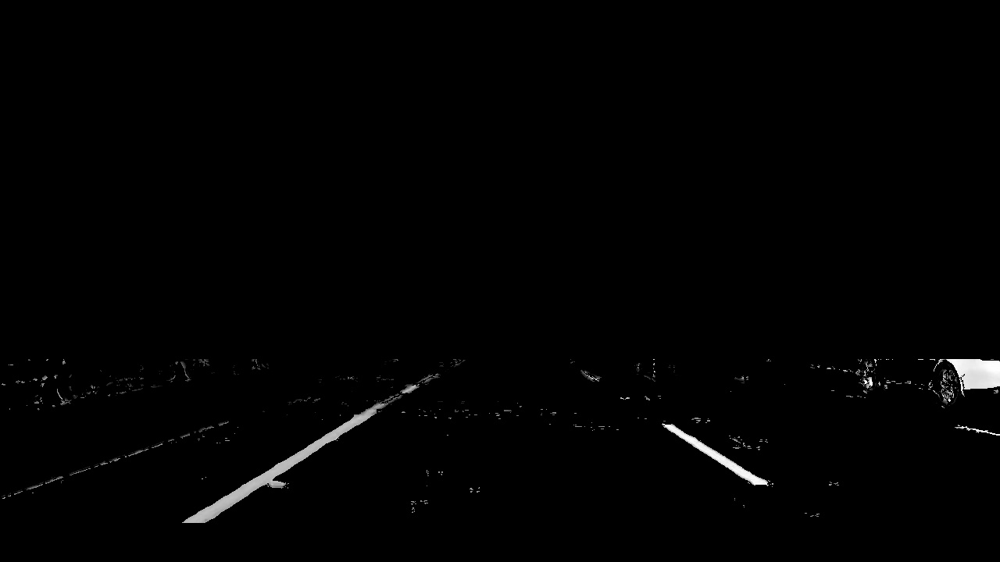
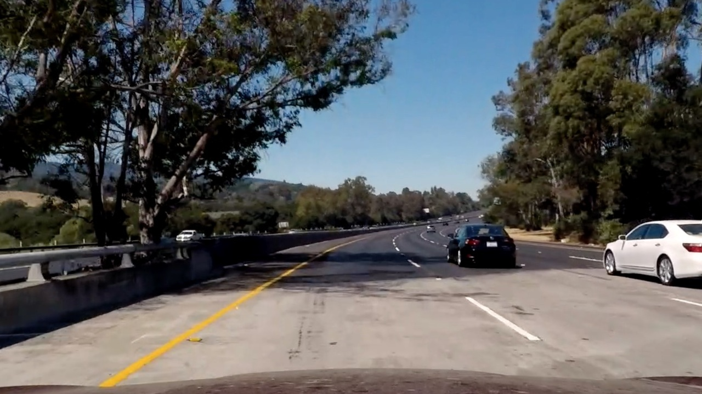
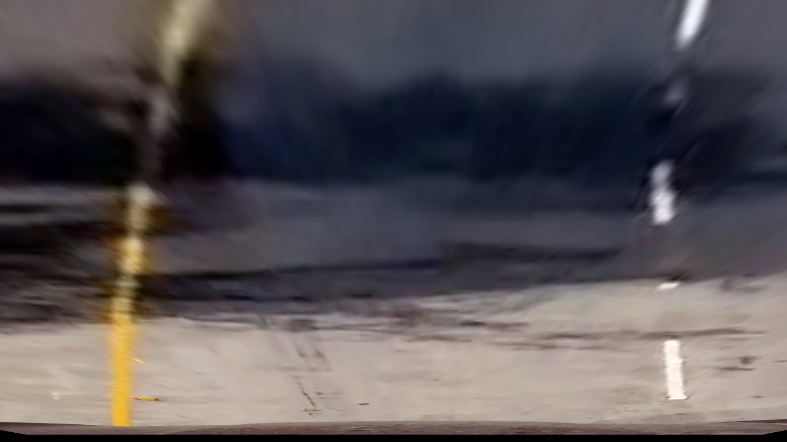
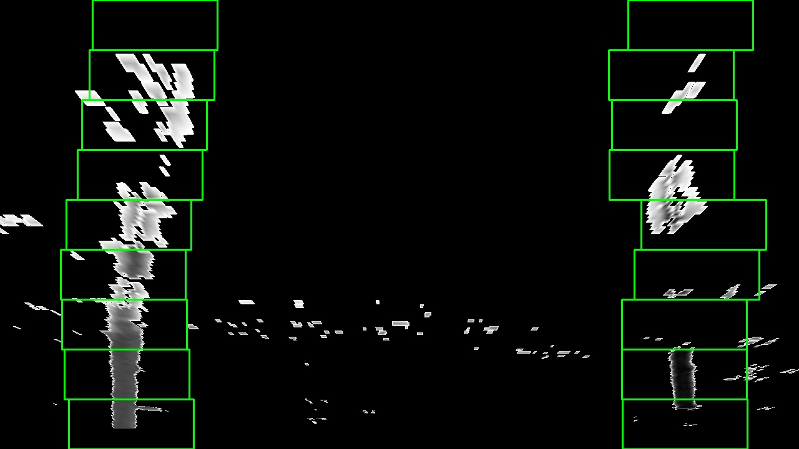
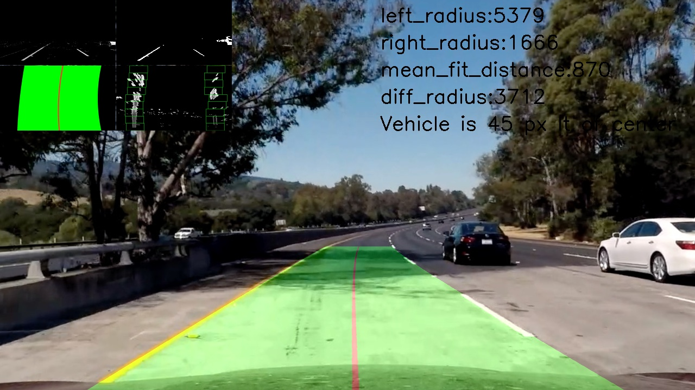

# **Advanced Lane Finding** 

---

**Advanced Lane Finding Project**

The goals / steps of this project are the following:

* Compute the camera calibration matrix and distortion coefficients given a set of chessboard images.
* Apply a distortion correction to raw images.
* Use color transforms, gradients, etc., to create a thresholded binary image.
* Apply a perspective transform to rectify binary image ("birds-eye view").
* Detect lane pixels and fit to find the lane boundary.
* Determine the curvature of the lane and vehicle position with respect to center.
* Warp the detected lane boundaries back onto the original image.
* Output visual display of the lane boundaries and numerical estimation of lane curvature and vehicle position.

[//]: # (Image References)

[image10]: ./output_images/calibration_distort.jpg "distorted"
[image11]: ./output_images/calibration_undistort.jpg "Undistorted"
[image2]: ./output_images/test5.jpg "Road Transformed"
[image3]: ./output_images/gray.jpg "Binary Example"
[image4]: ./examples/warped_straight_lines.jpg "Warp Example"
[image5]: ./examples/color_fit_lines.jpg "Fit Visual"
[image6]: ./examples/example_output.jpg "Output"
[video1]: ./output_videos/project_video.mp4 "Video"

## [Rubric](https://review.udacity.com/#!/rubrics/571/view) Points

### Here I will consider the rubric points individually and describe how I addressed each point in my implementation.  

---

### Writeup / README

### Camera Calibration

#### 1. Computed the camera matrix and distortion coefficients.

The code for this step is contained in lines 10 of the file called `functions.py`.

I start by preparing "object points", which will be the (x, y, z) coordinates of the chessboard corners in the world. Here I am assuming the chessboard is fixed on the (x, y) plane at z=0, such that the object points are the same for each calibration image.  Thus, `objp` is just a replicated array of coordinates, and `objpoints` will be appended with a copy of it every time I successfully detect all chessboard corners in a test image.  `imgpoints` will be appended with the (x, y) pixel position of each of the corners in the image plane with each successful chessboard detection.  

I then used the output `objpoints` and `imgpoints` to compute the camera calibration and distortion coefficients using the `cv2.calibrateCamera()` function.  I applied this distortion correction to the test image using the `cv2.undistort()` function and obtained this result: 

<div class="test">


</div>

### Pipeline (single images)

#### 1. Provide an example of a distortion-corrected image.

To demonstrate this step, I will describe how I apply the distortion correction to one of the test images like this one:

<div class="test">

</div>

#### 2. I used color transforms, gradients or other methods to create a thresholded binary image.  Provide an example of a binary image result.

I used a combination of color and gradient thresholds to generate a binary image (thresholding steps at lines 36-41 in `find_line.py`).  Here's an example of my output for this step.

<div class="test">

</div>

#### 3. Performed a perspective transform and provide an example of a transformed image.

The code for my perspective transform includes a function called `get_perspective()`, which appears in lines 195 through 207 in the file `functions.py`.   The `get_perspective()` function takes as inputs an image (`img`), as well as source (`src`) and destination (`dst`) points.  I chose the hardcode the source and destination points in the following manner:

```python
src = np.float32([(555, 480), (752, 480), (228, 700), (1072, 700)])
dst = np.float32([(228, 315), (1072, 315), (228, 700), (1072, 700)])
```

This resulted in the following source and destination points:

| Source        | Destination   | 
|:-------------:|:-------------:| 
| 555, 480      | 228, 315        | 
| 752, 480      | 1072, 315      |
| 228, 700     | 228, 700      |
| 1072, 700      | 1072, 700        |

I verified that my perspective transform was working as expected by drawing the `src` and `dst` points onto a test image and its warped counterpart to verify that the lines appear parallel in the warped image.

<div class="test">


</div>


#### 4. Identified lane-line pixels and fit their positions with a polynomial.

Then I did some other stuff and fit my lane lines with a 2nd order polynomial kinda like this:

<div class="test">

</div>

#### 5. Calculated the radius of curvature of the lane and the position of the vehicle with respect to center.

I did this in lines 159-166 in my code in `find_line.py`

#### 6. Provide an example image of my result plotted back down onto the road such that the lane area is identified clearly.

I implemented this step in lines 213 in my code in `find_line.py` in the function `find_line()`.  Here is an example of my result on a test image:

<div class="test">

</div>

---

### Pipeline (video)

#### 1. My final video output. 
 
Here's a [link to my video result](./output_videos/project_video.mp4)
---

